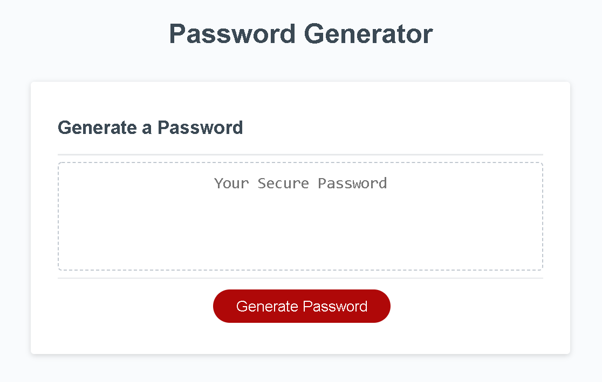
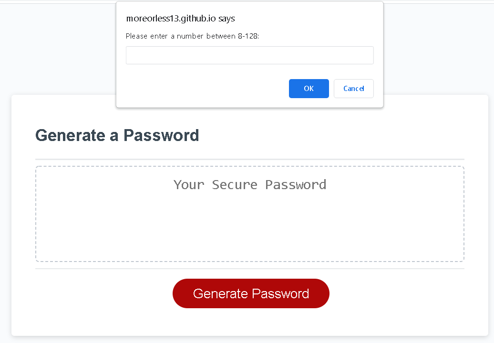
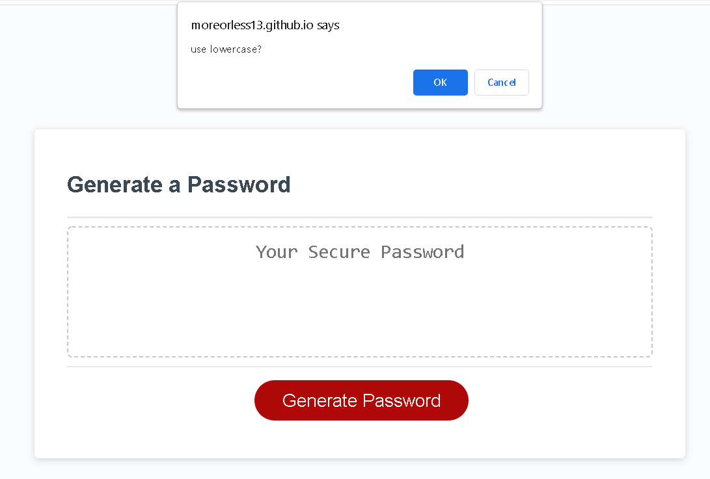
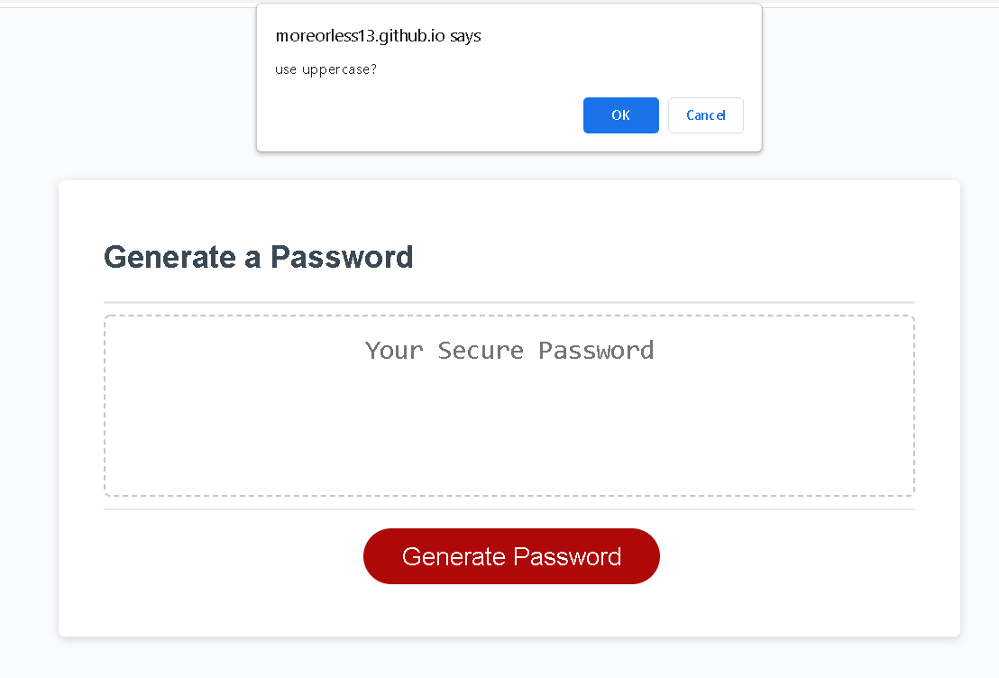
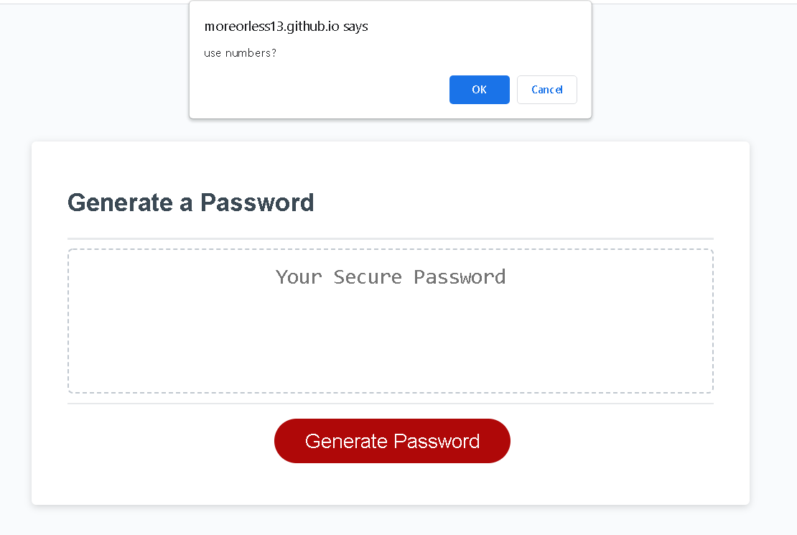
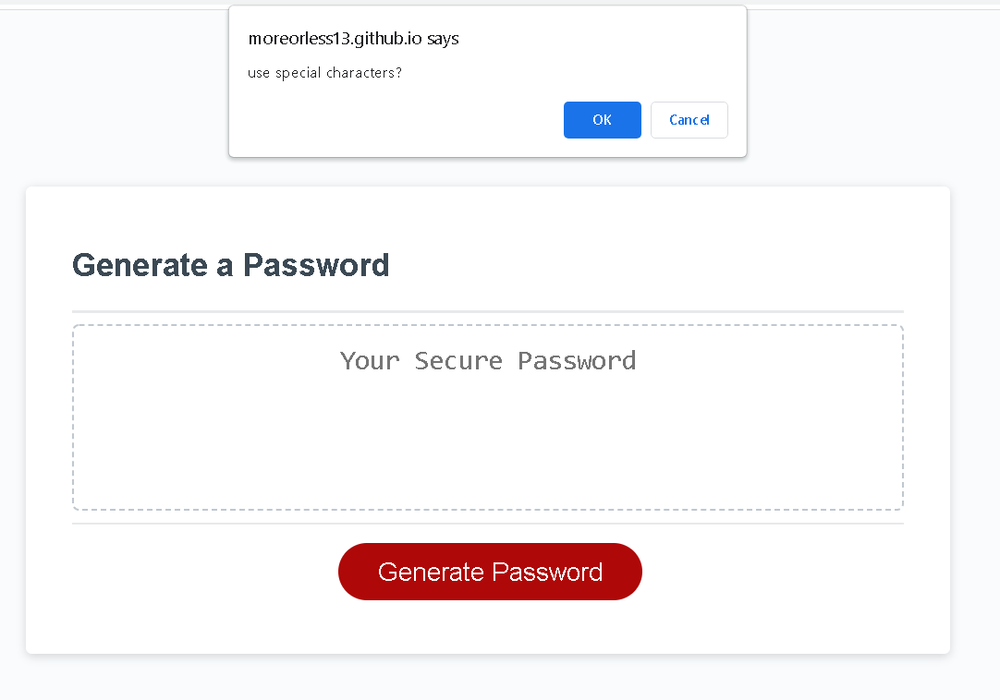
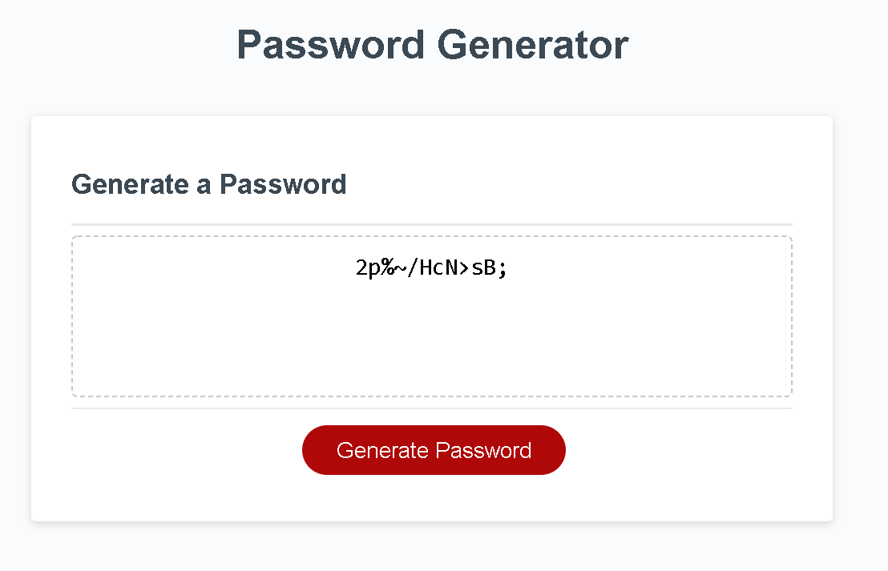

# callback-h3ll
Javascript password generator homework. 

click "Generate Password" on the following screen:

this will prompt a window to enter your preferred password length between 8-128 characters long.

valid response will cause cascade of confirmation prompts asking for your preference of types of characters. confirmation of at least one of the following is a must or you will be prompted to start from the beginning

upon successful validation of userPreferences to meet minimum criteria, the final display will look similar to the following.

